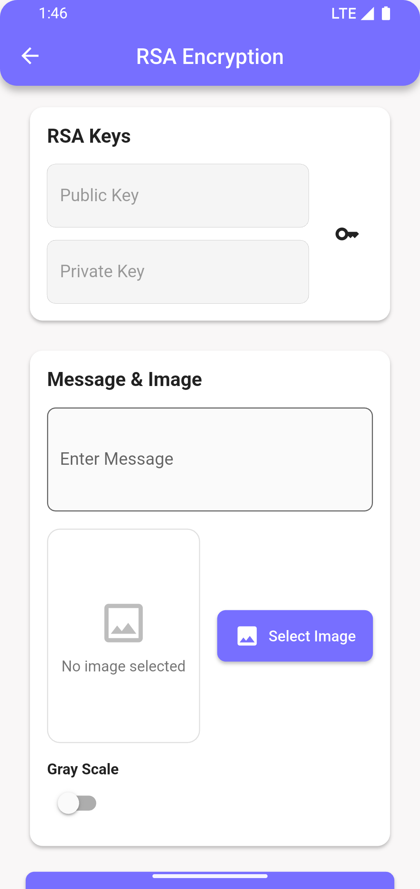

## Fitur Utama

- Enkripsi pesan menggunakan algoritma AES
- Enkripsi pesan menggunakan algoritma RSA dengan pembangkitan kunci publik & privat
- Penyembunyian pesan terenkripsi ke dalam gambar (steganografi)
- Dekripsi pesan dari gambar yang telah disisipi
- Opsi konversi gambar ke grayscale dengan noise
- Pengukuran waktu proses enkripsi dan dekripsi

## Screenshot

|          Screenshot 1          |          Screenshot 2          |
| :----------------------------: | :----------------------------: |
|  |  |

|          Screenshot 3          |          Screenshot 4          |
| :----------------------------: | :----------------------------: |
|  |  |

## Persyaratan Sistem

- Android 5.0 (API level 21) atau lebih tinggi
- Izin penyimpanan untuk menyimpan hasil enkripsi
